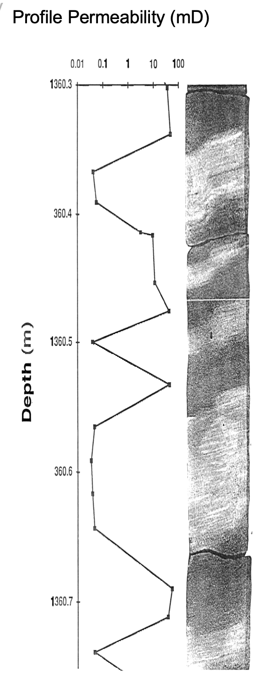

# Utilize-Core-Images-to-Calibrate-Borehole-Images

The Objective of this program we take continuous high-resolution digital core images of the reservoir rock and process these images to define sand vs. shale for continuous core data to be used for Borehole Image log calibration and Sand Count.

Introduction:
We routinely acquire Borehole Image logs to support our geologic and petrophysical understanding and interpretations of the reservoir. However, there are economic reasons that require us to maximize the utility of these borehole images to better understand and quantify Net-to-Gross and the actual sand count of the reservoir with depth. The proposed Python program will allow us to use our continuous core images from the same well as our borehole image, process the core images to define sand vs. shale and then calibrate the borehole image to quantify the sand count with depth. This can have tremendous financial benefits for our Deep Water Turbidite wells where the drilling costs are exorbitant and a precise understanding of the Net-to-Gross of our reservoir is a necessity. 

Our plan is to create continuous concatenated core images as shown below and create a log to define sand count with depth. 

Continuous, high-resolution Profile Permeability measurements from the slab surface of the core are also found to be quite useful in validating the quality of the sands and the flow capacity of each sand. 

It is possible to train the core images for even borehole images to predict a high-resolution permeability log to define the permeability profile of the reservoir. It is also reasonable to expect to be able to estimate capillary pressure and Rock Types along the borehole in the process. 

We need data. If anyone has the appropriate data that they could contribute to this project, it would very much appreciated. 

1. Georgi, D.T., Phillips C. and Hardman, R, Applications of Digital Core Image Analysis to Thin-Bed Evaluation, SPE, 1992, SPENC-9213
2. Phillips, C., DiFoggio R., Burleigh K., Extracting Information from Digital Images of Core, Society of Core Analysts, 5th Technical Conference, 1991, SCA-9125
