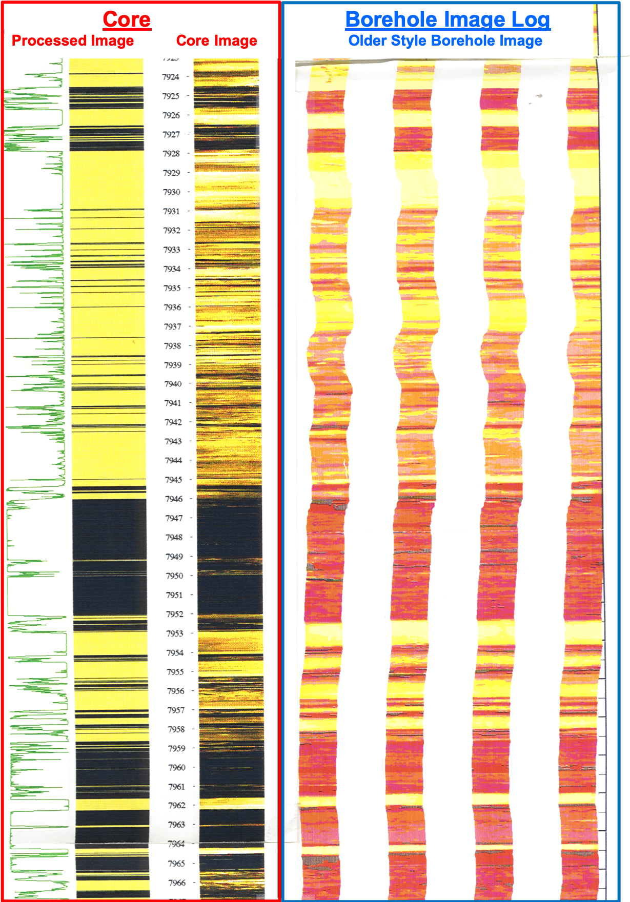

# Utilize-Core-Images-to-Calibrate-Borehole-Images

Objective:
With this program we take continuous high-resolution digital core images of the reservoir rock and process these images to define sand vs. shale for Borehole Imagelog calibration and Sand Count.

Introduction
We routinely acquire Borehole Image logs to support our geologic and petrophysical understanding of the reservoir. However, there are economic reasons that require us to maximize the utility of these borehole images to better understand Net-to-Gross and the actual sand count of the reservoir. The Python program proposed will allow us to use our continuous core images from the same well with our borehole image, process the core images to define sand vs. shale and calibrate the borehole image to quantify sand count with depth. This can have tremendous financial benefits for our Deep Water Turbidite wells where costs are exorbitant, and a precise understanding of Net-to-Gross is a necessity. 

Our plan is to create continuous concatenated core images as shown below and create a log to define sand count with depth. 

